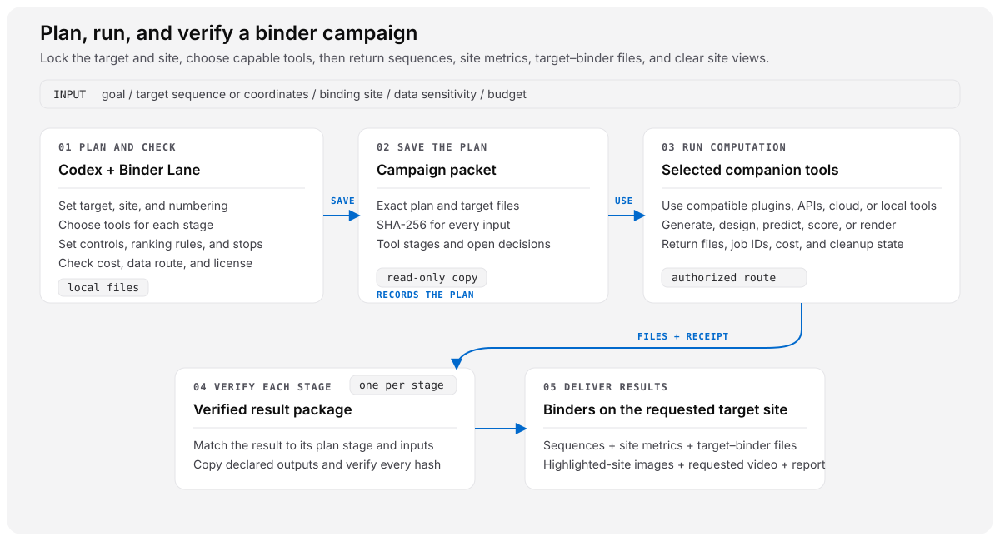
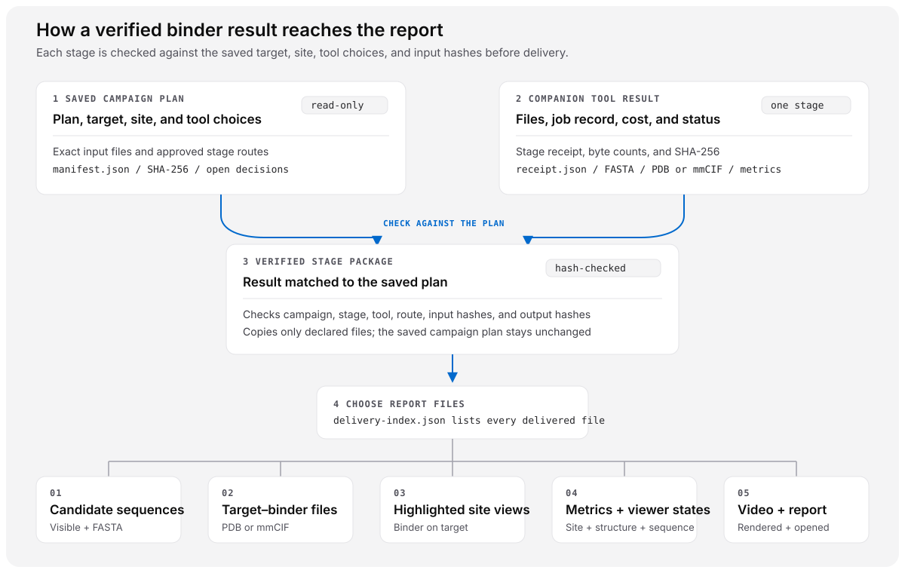

# Codex Binder Lane


Plan and design binders in Codex: pick target sites, tools and comp bio budget, then get your structures and sequences.

Codex Binder Lane is a provider-neutral control and evidence layer for protein-binder campaigns in Codex. It locks the exact target, construct, chain, residue numbering, and site; selects and supervises compatible design and prediction tools; and keeps every decision, approval, cost, artifact, and result tied to one reviewable campaign.

Selected companion tools generate, design, predict, score, rank, and render candidates. Binder Lane coordinates those tools and delivers every scoped candidate with its full amino-acid sequence, site-aware metrics, target–binder PDB or mmCIF coordinates, a clear view of the binder on the complete target with the requested site highlighted, and the underlying evidence files. It keeps transport integrity, prediction scores, and campaign conclusions as separate evidence classes.

Use the plugin when a request spans several scientific roles, tools, providers, controls, or optimization rounds. You can specify the full toolchain or let Codex inspect current capabilities, choose compatible tools, write narrow reviewed adapters in the campaign workspace, and substitute another route when a preferred tool is unavailable. Codex asks before a choice changes scientific intent, authorized spend, data transfer, license acceptance, or another material external effect.

The bundled scripts require Python 3.10 or later, use only the Python standard library as Python dependencies, and make no provider call during the documented local workflow. Delivery validation additionally requires local `ffmpeg` and `ffprobe` when JPEG, WebP, MP4, or WebM evidence is present. The `0.3.0` release passes all 177 shipped tests locally (8 public-surface and 169 plugin tests) on Python 3.10 through 3.14.

## What happens in a campaign



Each completed stage gets its own verified result package. Binder Lane checks that package against the saved plan before its sequences, metrics, coordinates, views, and report enter the delivery:



## How execution works

| Component | Responsibility |
| --- | --- |
| Binder Lane package | Initializes the workspace, validates the plan and target/site lock, records authorization and cost limits, verifies immutable packets, imports each stage result, and validates the final delivery. |
| Selected computational companions | Run generation, sequence design, prediction, scoring, optimization, and rendering after authorization. Codex can compose callable skills, command-line tools, hosted APIs, cloud jobs, and reviewed workspace adapters. |
| Schema-v1 base packet | Freezes the inputs and decisions at a `plan-only` ceiling. Authorized companions run the stages; their receipts and artifacts enter separate hash-bound result packages. |

Use `full-campaign` for the complete default funnel. Use `custom-campaign` for a deliberate subset such as site discovery, a tool comparison, or a prediction-only rerun. A site-discovery campaign records its selected residues and evidence, then feeds a new locked generation plan. Technical canaries and deposited-complex evaluations retain their narrower scopes.

Binder Lane verifies each stage package separately. Before reporting a whole campaign as complete, reconcile the planned stages, sibling result packages, candidate lineage, cumulative cost, cleanup states, stop reason, and final delivery. The v2 presentation validator checks the delivered sequences, metrics, coordinates, visuals, media, and file inventory; it does not by itself prove that every planned computation ran.

## Install

Install the current stable release from its exact tag:

```bash
codex plugin marketplace add jvogan/codex-binder-lane --ref v0.3.0
codex plugin add codex-binder-lane@codex-binder-lane
```

Start a new Codex task after installation so Codex loads the new skill version.

Binder Lane itself needs only Codex and Python for planning, locking inputs, validating receipts, and building the delivery. It does not bundle model weights, provider accounts, or a fixed compute backend. For live generation, design, prediction, scoring, or rendering, select at least one compatible capability that is callable in the current task. That capability may come from a Codex or Rosalind companion plugin, a hosted API, a local command-line tool, a cloud job, or a reviewed workspace adapter. The Molecular Structure Viewer and Biological Sequence & Alignment Viewer add interactive review when available; portable FASTA, PDB/mmCIF, metrics, images, and reports remain the baseline output.

To switch between pinned releases, remove the installed plugin and marketplace snapshot, then add the desired tag and reinstall:

```bash
codex plugin remove codex-binder-lane@codex-binder-lane
codex plugin marketplace remove codex-binder-lane
codex plugin marketplace add jvogan/codex-binder-lane --ref <release-tag>
codex plugin add codex-binder-lane@codex-binder-lane
```

Start another new task after reinstalling. To uninstall completely, run the first two commands only.

## Use with Rosalind Workbench

Rosalind Workbench and Binder Lane are separate Codex plugins. Rosalind is a launcher and discovery surface for life-science capabilities; Binder Lane is the campaign control and evidence layer. Installing Binder Lane does not add a Binder Lane tile to Rosalind, and `rosalind.open` is not a binder-design execution API.

For the combined workflow:

1. Install Binder Lane and separately enable Rosalind plus the scientific companion and viewer plugins you want to use.
2. Start a new Codex task and invoke `$codex-binder-lane` directly. Name preferred tools if you have them, or ask Codex to inspect the capabilities callable in that task.
3. Let Binder Lane bind each selected companion to a campaign stage, retain its native outputs, and import a normalized receipt. Open hash-bound PDB/mmCIF and FASTA/A3M artifacts in the Molecular Structure Viewer and Biological Sequence & Alignment Viewer when they are callable.

The portable campaign artifacts remain the source of truth, so the work stays reviewable when Rosalind or either viewer is unavailable. A visible Binder Lane entry inside Rosalind would require a separate addition to Rosalind's curated catalog.

## Start in Codex

Invoke the skill explicitly or describe a multi-stage binder campaign; implicit invocation is enabled. A useful first prompt is:

```text
Use $codex-binder-lane for a binder campaign on target <ID and construct> at site
<residues or interface>. My input is <PDB, mmCIF, FASTA, or sequence>, and the data
are <public, private, or restricted>. Lock the target and site, choose compatible
generation, design, prediction, scoring, and rendering tools, and return for every
scoped candidate its full sequence, site-aware metrics, target–binder coordinates,
and a white-background image with the binder on the target and the exact site
highlighted. Include an HTML report, raw files, and a real video only if requested.
Ask before paid compute or private-data transfer.
```

The first pass produces a local capability inventory, the material unresolved decisions, a campaign workspace, validation results, and explicit gates. After the user authorizes a selected companion, Codex runs that toolchain and imports its receipts and outputs. Tool installation alone does not authorize scientific compute.

For an external worked reference, the bundled capability-routing guide links Anthropic's [campaign overview](https://www.anthropic.com/research/Claude-accelerates-protein-design), [technical report](https://www-cdn.anthropic.com/30bf50e22a01388bb29bf077ee3f244531594b7a.pdf), [released campaign data](https://huggingface.co/datasets/Anthropic/claude-protein-binder-design), and [multi-target protocol prompt pinned at `d442eeb`](https://huggingface.co/datasets/Anthropic/claude-protein-binder-design/blob/d442eeb/prompts/prompts/multi_target_binder_design_prompt.md). A plan must declare whether it reproduces, approximates, or swaps that study and record every material difference. Binder Lane does not apply the study as a default workflow.

## Run the local workflow

From the repository root, set `SKILL_DIR` and `ARTIFACT_ROOT`, then keep the shell there. This example keeps normalized target artifacts in the campaign workspace; choose another exact directory if needed. Every command below is local.

```bash
SKILL_DIR=plugins/codex-binder-lane/skills/codex-binder-lane
ARTIFACT_ROOT=campaign-workspace
```

1. Initialize all coupled campaign starters at once.

   ```bash
   python3 "$SKILL_DIR/scripts/init_campaign.py" \
     example-campaign campaign-workspace \
     --profile classic \
     --confidentiality public \
     --json
   ```

   Use `--profile complexa` for the bundled codesign profile. The initializer refuses an existing output path and does not invent target, site, provider, price, license, authorization, or result facts.

2. Inventory local capability evidence.

   ```bash
   python3 "$SKILL_DIR/scripts/capability_inventory.py" --workspace "$PWD" --json
   ```

   Default inventory is static: it does not invoke the Codex CLI or execute code from discovered optional repositories. Its machine-local paths and credential-presence booleans are diagnostic data, not portable campaign evidence. Use `--probe-codex-cli` only when a local CLI listing is deliberately requested. If the user deliberately selects a BioSymphony checkout, read that checkout's instructions first, then pass its exact root with `--probe-biosymphony-root`.

3. Resolve the campaign decisions, complete the target lock and residue map, and validate all three contracts.

   Rename `target-site-lock.template.json` to `target-site-lock.json`. Seal its artifact hashes and byte counts, then update `plan.target.target_lock` with that lock's path, SHA-256, and byte count and update `plan.target.residue_map` with the residue-map path and SHA-256 before packet materialization.

   ```bash
   python3 "$SKILL_DIR/scripts/validate_plan.py" \
     campaign-workspace/codex-binder-plan.json
   python3 "$SKILL_DIR/scripts/validate_target_site.py" \
     campaign-workspace/target-site-lock.json \
     --artifact-root "$ARTIFACT_ROOT"
   python3 "$SKILL_DIR/scripts/validate_qualification.py" \
     campaign-workspace/qualification-ledger.json
   ```

   See the bundled target/site lock reference for exact fields, hashes, byte counts, chain mapping, and residue-map rules. The initialized `.template` files are deliberately incomplete until reviewed facts replace their placeholders.

4. Materialize and verify the local packet at a new path.

   ```bash
   python3 "$SKILL_DIR/scripts/campaign_packet.py" materialize \
     campaign-workspace/codex-binder-plan.json \
     campaign-workspace/target-site-lock.json \
     campaign-workspace/qualification-ledger.json \
     campaign-workspace/campaign-packet \
     --artifact-root "$ARTIFACT_ROOT"

   python3 "$SKILL_DIR/scripts/campaign_packet.py" status \
     campaign-workspace/campaign-packet
   python3 "$SKILL_DIR/scripts/campaign_packet.py" resume-check \
     campaign-workspace/campaign-packet
   ```

`materialize` and `status` can return status 0 for a valid packet whose dispatch remains blocked. `resume-check` is read-only and returns status 2 for a verified schema-v1 packet. None of these commands starts work.

5. If a deliberately selected companion later completes or fails exactly one frozen stage, normalize and import its receipt and declared outputs into a new overlay.

   For a later completed receipt, authorize that ceiling before materialization: use plan and qualification `mode: "execute"`, set `plan.evidence.claim_ceiling` and the target/site lock `claim_ceiling` to `transport-proven`, and bind the exact selected route and provider. The initializer intentionally leaves these values at `plan-only`. A failed receipt may remain `plan-only`.

   ```bash
   python3 "$SKILL_DIR/scripts/campaign_overlay.py" import-stage \
     campaign-workspace/campaign-packet \
     companion-stage-receipt.json \
     campaign-workspace/companion-overlay \
     --artifact-root companion-output-root \
     --json

   python3 "$SKILL_DIR/scripts/campaign_overlay.py" verify \
     campaign-workspace/campaign-packet \
     campaign-workspace/companion-overlay \
     --json
   ```

The bundled receipt normalizer accepts only its documented computational receipt shape and emits the strict overlay schema. The importer is local and offline. It preserves the base packet as dispatch-blocked and `plan-only`; the separate overlay can establish only a hash-bound `transport-proven` claim. It does not poll a provider, prove that a provider executed work, or interpret scientific quality.

For a completed BioSymphony hosted-Chai result, `normalize_biosymphony_chai_receipt.py normalize-stage` is the shipped adapter. It verifies the native receipt and selected observation row, copies four declared artifacts byte-for-byte, and produces the receipt consumed by `campaign_overlay.py`. See the bundled companion receipt overlay reference for its exact arguments and pre-run packet requirements.

6. When an HTML report, visible sequences, structure visuals, or video are promised, copy `assets/delivery-index.template.json`, populate its hash-bound references, and validate the built report.

   ```bash
   cp "$SKILL_DIR/assets/delivery-index.template.json" \
     CAMPAIGN_DELIVERY_ROOT/delivery-index.json
   python3 "$SKILL_DIR/scripts/validate_delivery.py" CAMPAIGN_DELIVERY_ROOT \
     --index delivery-index.json --json
   ```

   This check requires full scoped sequences, site-aware metrics, raw FASTA and target–binder coordinate downloads, and a white-background image that declares the target chain, binder chain, and highlighted locked site. When video is requested, a real MP4/WebM must be embedded and browser-tested. It excludes dependency trees, tool caches, and vendored examples from the delivery index. The check proves that the report opens and contains the promised evidence; it does not judge candidate quality.

## Viewer and renderer handoff

When the plan requests interactive review and the viewers are callable, open the Molecular Structure Viewer and Biological Sequence & Alignment Viewer, reuse each `viewerSessionId` in the same Codex task, and save the final state. Structure selections use author numbering and assembly instance; sequence coordinates are 1-based. If a viewer is unavailable, retain the same portable FASTA/A3M, PDB/mmCIF, hashes, and inspection instructions so the result remains reviewable.

PyMOL and ChimeraX are complementary renderer routes. They do not replace the portable scientific files or viewer-state record. The release includes a sealed 1ZVH PyMOL example; arbitrary targets use the typed renderer request/receipt contract through any compatible reviewed adapter. The Molecular Structure Viewer, discoverable through Rosalind when installed and callable, remains the preferred interactive Codex path when it can produce the requested scene.

## What has been tested end to end

- The local control-plane path is exercised from validated plan, target lock, and qualification inputs through deterministic packet materialization, exact-file and hash verification, blocker projection, status, and read-only resume checking.
- A strict one-stage companion-receipt fixture is exercised through import, deterministic overlay creation, exact-file verification, base-packet immutability, secret and private-endpoint rejection, symlink rejection, and base/overlay tamper detection. This is an offline importer test, not a live provider run.
- A deterministic non-biological canary exercises portable sequence, coordinate, metric, lineage, receipt, report, viewer, renderer, and media handoffs at a `transport-proven` ceiling.
- The fail-closed public export is generated twice and compared byte-for-byte; its receipt covers the exact public file set and every published file hash. The exporter rejects known credential patterns and common escaped-key forms, but no pattern scanner can prove the absence of deliberately obfuscated source secrets; gitleaks worktree/history checks and human review remain release gates.
- The built plugin is synchronized to a fresh temporary destination and checked for file drift. Discovery metadata declares explicit and implicit skill invocation.
- Automated tests exercise the locked public 1ZVH coordinate parser and local geometry evaluator without generation, prediction, ranking, upload, or provider calls.
- A deterministic delivery fixture exercises visible candidate sequences, raw-artifact links, structure renders, viewer-state outputs, browser evidence, storyboard/video separation, and curated-manifest scope.

## Current implementation

- Codex invokes selected companion skills for generation, sequence design, folding, complex prediction, ranking, optimization, and rendering. Those tools own provider calls; Binder Lane saves and checks the campaign record and delivery evidence.
- The importer verifies one stage per directory. A multi-stage campaign uses sibling result-package directories; the release does not merge them into one package or poll their providers.
- The bundled normalizer accepts one documented computational receipt shape. Each additional companion receipt shape needs an adapter that preserves its native files and hashes.
- This release includes a fixed 1ZVH PyMOL adapter. For other targets, Codex can author a narrow, reviewed PyMOL or ChimeraX adapter against the same typed handoff contract.
- Large native outputs can remain on external storage or in cloud workspaces. Import compact review artifacts and hashes into the delivery bundle while retaining the complete dataset in the campaign record.
- License checks validate recorded license declarations and required authorization fields; schema v1 does not determine legal or commercial compatibility for the user.
- The repository contains no live 1ZVH provider receipt or ranked generated candidate. Its 1ZVH files test local coordinate evaluation.
- Publishing the release-candidate tag, running hosted Python 3.10 through 3.14 CI on that tag, and installing from a clean Codex profile remain release operations.

## What the fixture results prove

The synthetic canary tests file transport and hash checks. The locked 1ZVH workflow tests coordinate parsing and geometry. Neither fixture tests generated-binder quality.

## Verify the release tree

```bash
python3 scripts/verify_public_export.py
python3 -m unittest discover -s tests -v
python3 -m unittest discover -s plugins/codex-binder-lane/tests -v
python3 -m compileall -q scripts tests plugins/codex-binder-lane
```

`public-export-receipt.json` records the classification, byte count, source path, and SHA-256 of each published file. The bundled verifier checks receipt consistency, the exact release file set, the plugin manifest, and the marketplace entry. It is not an independent provenance attestation: release maintainers regenerate the allowlisted tree from the declared source revision, compare it byte-for-byte, and retain that evidence before publication.

See the [0.3.0 release notes](docs/release-notes-0.3.0.md) for the exact release boundary and measured checks.

## License

The repository's original code and documentation use [Apache-2.0](LICENSE). Third-party software, model weights, datasets, and hosted services retain their own terms.

Use of the plugin is also subject to the public [Terms](TERMS.md). The [Privacy Policy](PRIVACY.md) explains local processing, optional transfer to separately selected companion services, retention, and user controls.
